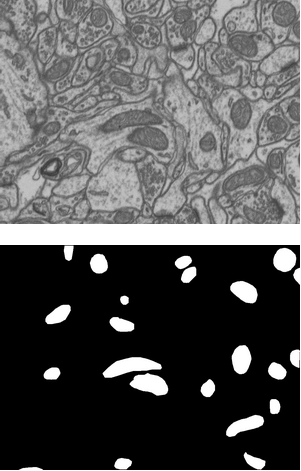
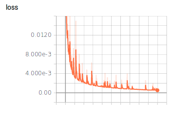
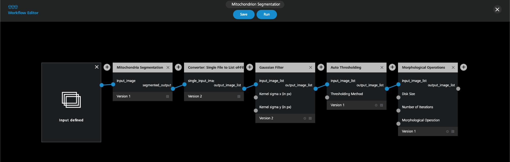
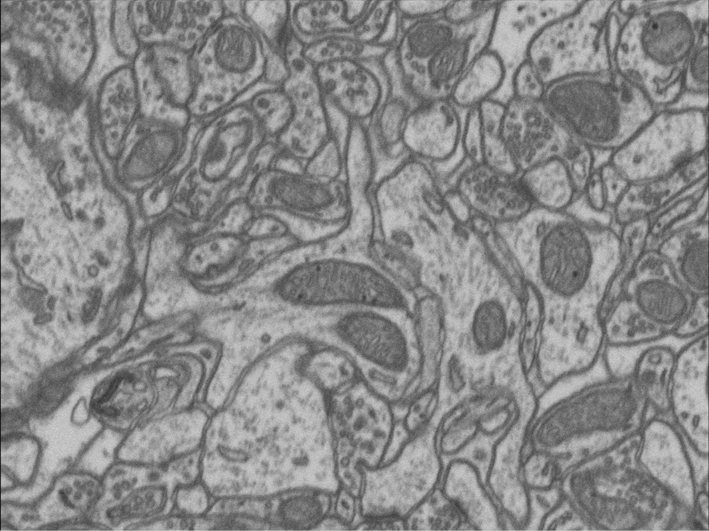
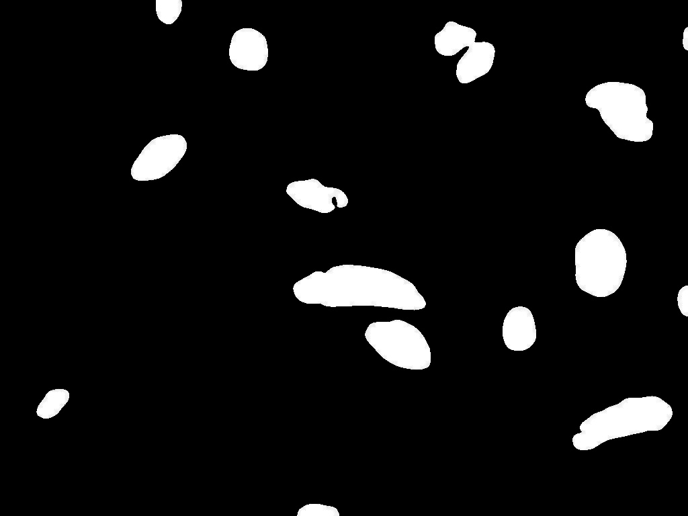

# Deep UNet for Mitochondira Segmentation (Zeiss India Contest)
> Members: Rohith Srinivaas M, Rishhanth Maanav V, Lokesh Kumar T (IIT Madras)
## Mitochondria - Power Factory of the Cell

* Morphology and distribution of intercellular components are of substantial biological importance
* Abnormal Mitochondria morphology can be seen in Parkinson’s disease related genes.
* Accurate Mitochondria segmentation can improve cell segmentation accuracy

## Deep Learning in Microscopy Imaging

* Deep Learning revolutionized the way Computer Vision has been seen in recent years.
* Deep learning has been well exploited in the field of Medical Imaging.
* We have used state of the art recently developed techniques for Mitochondria segmentation.

## Deep Unet for Image Segmentation

* Unet - Deep Learning Architecture used to solve biomedical image segmentation tasks.
* An improved version of Unet - **Deep Unet**, (Sept. 2018) was originally used for Pixel level sea land segmentation from satellite image.
* We have used **Deep Unet for Mitochondria segmentation**. 

## Dataset Description

* The dataset used is Electron Microscopy dataset.
* The dataset represents a 5x5x5µm section taken from the CA1 hippocampus region of the brain, corresponding to a 1065x2048x1536 volume. 
* The resolution of each voxel is approximately 5x5x5nm.
* The data is provided as multipage TIF files.

## Training Details

* The dataset was divided into train(3000 images) and test(500 images).
* 6-fold cross-validation was performed during the train procedure for better generalisation of the model.
* Libraries used: **TensorFlow, Keras**
* Training was performed with GTX 1080 Ti for 6 hrs..
* The training iteration was continued for 150 epoch
* Avg.Dice coefficient :  **0.973**.

## Apeer Workflow

* APEER platform to sum up was helpful in terms of the following usages,
    * Version-Control
    * Modular development
    * Easy Integration using Python

## Our Apeer Workflow

## Results

### Input Image

### Output Image
